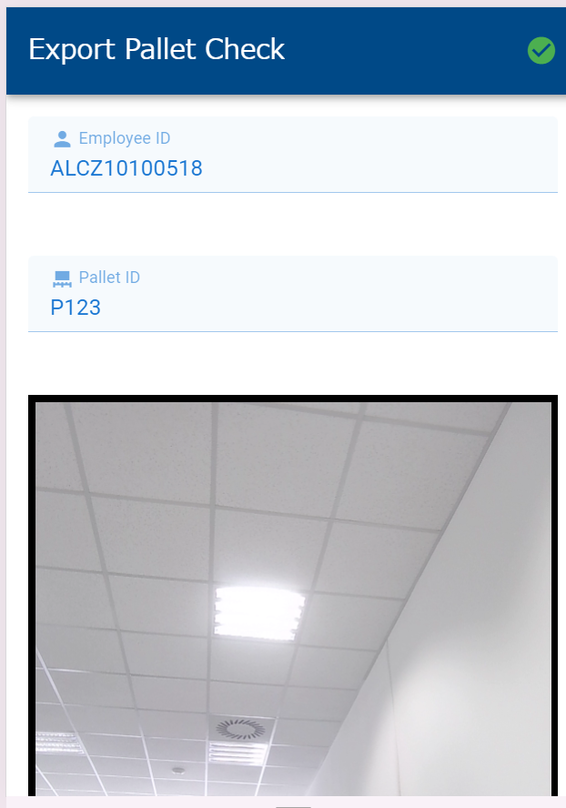
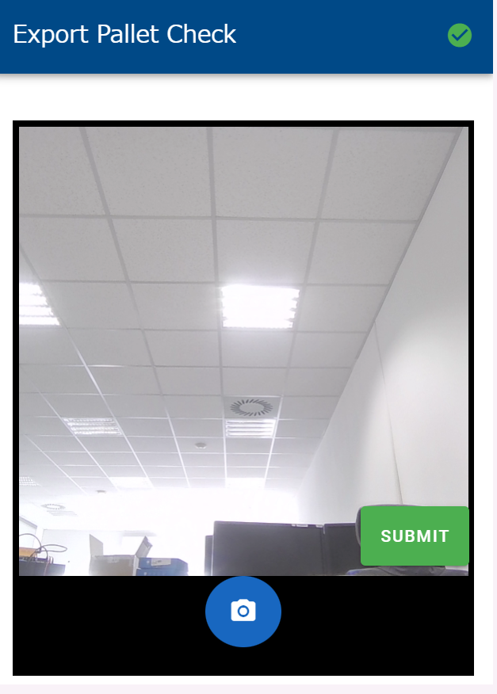
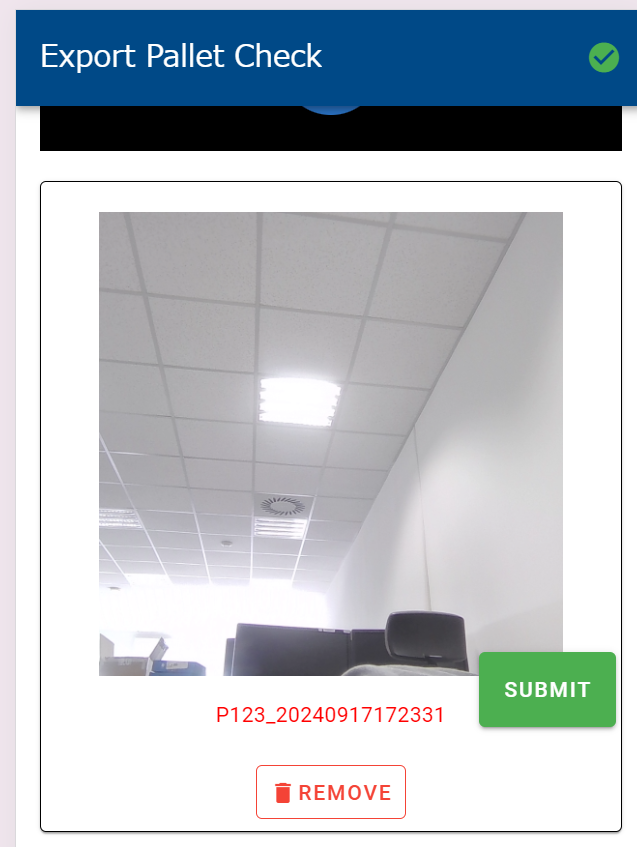

# Export Pallet Check
This repository is for the frontend of the project

## Overview
This project is designed to manage and track shipping pallet information in a warehouse. It stores photo data in a local folder, along with pallet IDs, employee IDs, and photo names in a JSON file. Additionally, the backend server updates the database with new records corresponding to the stored photos each time photos are submitted from the client side.


|  |  |  |
|------------------------------------------|------------------------------------------|------------------------------------------|


## Getting started
To start the frontend of this application, run the following command:
```
npm run dev
```


## Notes 
### Configuring the Barcode Reader
You need to configure the barcode reader to send the ENTER key after scanning. To do this, open the **DataWedge application** and navigate to **DataWedge Profiles > Keystroke Output > Basic data formatting**. On this page, enable both **Send data** and **Send ENTER key options**.

For more details, please refer to the following document: DataWedge for Android - Send Enter or Tab after scanning.


For more detail information see the following document. https://supportcommunity.zebra.com/s/article/DataWedge-for-Android-Send-Enter-or-Tab-after-scanning?language=en_US


## How to Use

1. **Scan Barcode for both Employee ID and Pallet ID**  
   The input forms accept both manual entry and barcode scanning, in case the barcode is damaged. After validation, the camera will be activated.

2. **Take Photos of the Pallet**  
   Press the button with the camera icon to take photos. Ensure you capture all four sides of the shipping pallet.

3. **Check Photos**  
   Verify that the photos are clear and appropriate.

4. **Submit Photos**  
   You can submit the photos by pressing the submit button located at the bottom-right corner.

5. **Repeat the Process**  
   The Employee ID will be auto-filled for the next entry. You can proceed by scanning the next Pallet ID.

---

**Note:**  
If you encounter a data inconsistency error, you will need to decide whether to delete the incorrect data or keep it. However, keeping incorrect data may cause the application to become unresponsive.
